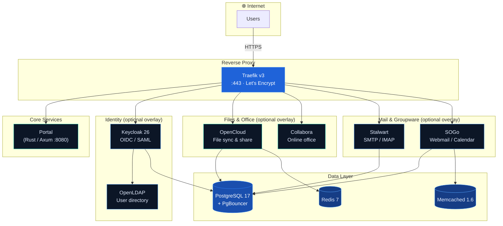

<div align="center">


# openDesk SME

**Self-hosted digital workplace for small &amp; medium enterprises.**

Docker Compose-based — from 5 to 500 users.

[](LICENSE.md)
[](https://docs.docker.com/compose/)
[](https://traefik.io/)
[](https://axum.rs/)

</div>

---

## Why openDesk SME?

| | Cloud Suite (Google / Microsoft) | Nextcloud | openDesk SME |
|---|---|---|---|
| **Data sovereignty** | ❌ Data on vendor servers | ✅ Self-hosted | ✅ Self-hosted |
| **Per-seat pricing** | 💰 $6–$36/user/mo | Free (self-hosted) | Free ≤50 users |
| **Mail server included** | Via add-on | ❌ Plugin needed | ✅ Stalwart (Rust) |
| **Groupware (calendar/contacts)** | ✅ | ⚠️ Plugins | ✅ SOGo |
| **Online office editing** | ✅ | ⚠️ Via Collabora | ✅ Collabora built-in |
| **SSO / IAM** | ✅ | ❌ | ✅ Keycloak + LDAP |
| **Single Docker Compose stack** | N/A | ❌ Manual | ✅ One `docker compose up` |
| **AGPL — no vendor lock-in** | N/A | ✅ | ✅ |

For 50 users on Google Workspace: **$300–$1,800/month**.
With openDesk SME on a Hetzner CX22 (~€15/mo): **€15/month total.**
That's a **95–99% cost reduction** while keeping full data sovereignty.

### Who is this for?

- **Small businesses** (5–50 users) who want Google Workspace functionality
  without per-seat fees or data leaving their control
- **Schools &amp; municipalities** required by law to keep data on-premises
- **Privacy-conscious teams** who need mail, files, calendar, and office in one stack
- **MSPs / IT consultants** deploying productivity suites for clients

| | |
|---|---|
| **IAM / SSO** | Keycloak + LDAP — OIDC, SAML, centralized auth |
| **Files** | OpenCloud — sync, share, collaborate |
| **Office** | Collabora — real-time document editing in the browser |
| **Mail** | Stalwart — modern Rust SMTP/IMAP server |
| **Groupware** | SOGo — webmail, calendar, contacts |
| **Database** | PostgreSQL 17 + PgBouncer connection pooling |
| **Cache** | Redis 7 + Memcached 1.6 |
| **Proxy** | Traefik v3 — automatic HTTPS via Let's Encrypt |
| **Portal** | Custom Rust/Axum landing page — service directory |

## What's inside?

| | |
|---|---|
| **IAM / SSO** | Keycloak 26 + OpenLDAP — OIDC, SAML, centralized auth |
| **Files** | OpenCloud — sync, share, collaborate |
| **Office** | Collabora — real-time document editing in the browser |
| **Mail** | Stalwart — modern Rust SMTP/IMAP server |
| **Groupware** | SOGo — webmail, calendar, contacts |
| **Database** | PostgreSQL 17 + PgBouncer connection pooling |
| **Cache** | Redis 7 + Memcached 1.6 |
| **Proxy** | Traefik v3 — automatic HTTPS via Let's Encrypt |
| **Portal** | Custom Rust/Axum landing page — service directory |

## Architecture



## Quick Start

### 1. Clone &amp; configure

```bash
git clone https://github.com/tobias-weiss-ai-xr/opendesk-compose.git
cd opendesk-compose
cp .env.example .env
# Edit .env — set your domains and passwords
```

### 2. Start core services

```bash
# Portal + Traefik + PostgreSQL + Redis + Memcached
docker compose up -d
```

### 3. Add features (overlays)

```bash
# Core + IAM + file sync + online office
export COMPOSE_FILE="docker-compose.yml:idm/keycloak.yml:opencloud/opencloud.yml"
docker compose up -d

# Full stack (add mail + groupware)
export COMPOSE_FILE="docker-compose.yml:idm/keycloak.yml:opencloud/opencloud.yml:mail/stalwart.yml:mail/sogo.yml"
docker compose up -d
```

### 4. Try the demo (minimal resources)

```bash
./scripts/demo.sh
# → Portal:    http://localhost:8080
# → Keycloak:  http://localhost:8081
# → OpenCloud: http://localhost:8082
```

Requires **2 vCPU / 4 GB RAM** — perfect for evaluation.

## Hardware Tiers

All tiers run the **same Compose stack** — scale vertically, no config changes.

| Tier | Users | vCPU | RAM | Storage | Reference |
|---|---|---|---|---|---|
| **Small** | 1–50 | 4–8 | 16–32 GB | 100–250 GB NVMe | Hetzner CX22 / CX32 |
| **Medium** | 50–500 | 12–16 | 48–64 GB | 500 GB–1 TB NVMe | Hetzner CX42 / CX62 |
| **Enterprise** | 500+ | Individual | | | Contact for sizing |

## Overlay System

Each feature is a separate Docker Compose file. Combine via `COMPOSE_FILE`:

| Overlay | Services | Domain | When to add |
|---|---|---|---|
| `docker-compose.yml` | Portal, Traefik, PostgreSQL, Redis, Memcached | `portal.*` | Always (core) |
| `idm/keycloak.yml` | Keycloak + OpenLDAP | `auth.*` | For SSO / IAM |
| `opencloud/opencloud.yml` | OpenCloud + Collabora | `cloud.*`, `collabora.*` | For file sync & office |
| `mail/stalwart.yml` | Stalwart Mail Server | `mail.*` | For email |
| `mail/sogo.yml` | SOGo Groupware | `webmail.*` | For webmail / calendar |
| `profiles/demo.dev.yml` | (overrides) | — | For demo / dev (low resources) |

## Configuration

All configuration via `.env`. See [`.env.example`](.env.example) for the full list.

| Variable | Default | Description |
|---|---|---|
| `OPENDESK_DOMAIN` | `opendesk-sme.org` | Root domain for all services |
| `POSTGRES_PASSWORD` | `CHANGEME_*` | PostgreSQL superuser password |
| `KEYCLOAK_ADMIN_PASSWORD` | `CHANGEME_*` | Keycloak admin password |
| `OC_ADMIN_PASSWORD` | `CHANGEME_*` | OpenCloud admin password |
| `TRAEFIK_ACME_EMAIL` | `admin@...` | Let's Encrypt registration email |
| `TRAEFIK_USERS` | `admin:$$apr1$$...` | Traefik dashboard basic-auth (htpasswd) |
| `OPENDESK_TIER` | `starter` | Resource profile: `starter` \| `business` \| `enterprise` |

> **⚠️ Change all `CHANGEME_*` passwords before production!**
> Use `openssl rand -base64 24` to generate secure values.

## Scripts

| Script | Description |
|---|---|
| `scripts/start.sh` | Start the stack (core + keycloak + opencloud) |
| `scripts/stop.sh` | Stop all services |
| `scripts/demo.sh` | Launch minimal demo with random passwords |
| `scripts/backup.sh` | Backup PostgreSQL + Traefik data |

## License

**Free for organizations with up to 50 users** (Small tier — AGPL v3).
Larger deployments require a commercial license.

| Tier | Users | License |
|---|---|---|
| **Small** | 1–50 | ✅ Free (AGPL v3) |
| **Medium** | 50–500 | 💰 Commercial |
| **Enterprise** | 500+ | 💰 Individual |

See [LICENSE.md](LICENSE.md) for full terms. Commercial licenses available at
[[REDACTED]](https://[REDACTED]) or [graphwiz.ai](https://graphwiz.ai).

## Credits

Built with:

- [Axum](https://github.com/tokio-rs/axum) — Rust web framework (Portal)
- [Traefik](https://traefik.io/) — Reverse proxy &amp; automatic TLS
- [Keycloak](https://www.keycloak.org/) — Identity &amp; access management
- [OpenCloud](https://opencloud.eu/) — File sync, share &amp; collaboration
- [Collabora](https://www.collaboraoffice.com/) — Online office editing
- [Stalwart](https://stalw.art/) — Modern mail server (Rust)
- [SOGo](https://www.sogo.nu/) — Groupware &amp; webmail
- [PostgreSQL](https://www.postgresql.org/) — Relational database

<div align="center">

**[Quick Start](#quick-start) · [Architecture](#architecture) · [Configuration](#configuration) · [License](#license)**

</div>
