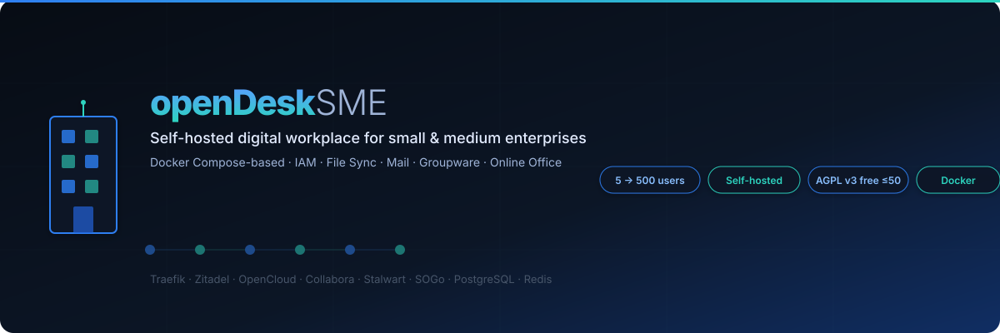
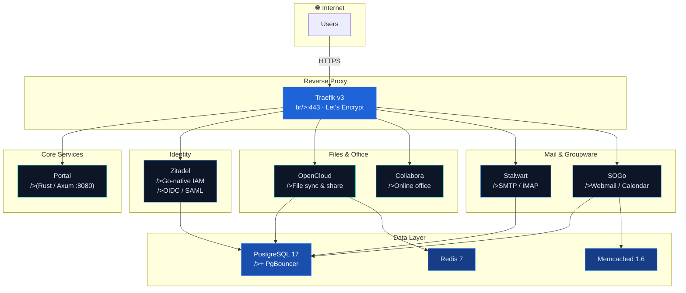

<div align="center">



# openDesk SME

**Self-hosted digital workplace for small &amp; medium enterprises.**

Docker Compose-based — from 5 to 500 users.

[](LICENSE.md)
[](https://docs.docker.com/compose)
[](https://traefik.io/)
[](https://axum.rs/)

[Quick Start](#quick-start) · [Architecture](#architecture) · [Overlays](#overlay-system) · [Configuration](#configuration) · [License](#license)

</div>

---

## Why openDesk SME?

| | Cloud Suite (Google / Microsoft) | Nextcloud | openDesk SME |
|---|---|---|---|
| **Data sovereignty** | ❌ Data on vendor servers | ✅ Self-hosted | ✅ Self-hosted |
| **Per-seat pricing** | 💰 $6–$36/user/mo | Free (self-hosted) | Free ≤50 users |
| **Mail server included** | Via add-on | ❌ Plugin needed | ✅ Stalwart (Rust) |
| **Groupware (calendar/contacts)** | ✅ | ⚠️ Plugins | ✅ SOGo |
| **Online office editing** | ✅ | ⚠️ Via Collabora | ✅ Collabora built-in |
| **SSO / IAM** | ✅ | ❌ | ✅ Zitadel |
| **Single Docker Compose stack** | N/A | ❌ Manual | ✅ One `docker compose up` |
| **AGPL — no vendor lock-in** | N/A | ✅ | ✅ |
| **No JVM** | N/A | N/A | ✅ Zitadel is Go-native |

For 50 users on Google Workspace: **$300–$1,800/month**.
With openDesk SME on a Hetzner CX22 (~€15/mo): **€15/month total.**
That's a **95–99% cost reduction** while keeping full data sovereignty.

### Who is this for?

- **Small businesses** (5–50 users) who want Google Workspace functionality
  without per-seat fees or data leaving their control
- **Schools &amp; municipalities** required by law to keep data on-premises
- **Privacy-conscious teams** who need mail, files, calendar, and office in one stack
- **MSPs / IT consultants** deploying productivity suites for clients

## What's inside?

| | |
|---|---|
| **IAM / SSO** | [Zitadel](https://zitadel.com/) — Go-native, no JVM, built-in user store |
| **Files** | [OpenCloud](https://opencloud.eu/) — sync, share, collaborate |
| **Office** | [Collabora](https://www.collaboraoffice.com/) — real-time document editing in the browser |
| **Mail** | [Stalwart](https://stalw.art/) — modern Rust SMTP/IMAP server |
| **Groupware** | [SOGo](https://www.sogo.nu/) — webmail, calendar, contacts |
| **Database** | PostgreSQL 17 + PgBouncer connection pooling |
| **Cache** | Redis 7 + Memcached 1.6 |
| **Proxy** | Traefik v3 — automatic HTTPS via Let's Encrypt |
| **Portal** | Custom Rust/Axum landing page — service directory |

## Architecture



### Why Zitadel instead of Keycloak?

| | Keycloak | Zitadel |
|---|---|---|
| **Language** | Java (JVM, ~512 MB base) | Go (binary, ~100 MB) |
| **Startup time** | 30–60 s | 5–10 s |
| **RAM (idle)** | 512 MB+ | 100 MB |
| **External DB** | Required (or embedded H2) | Required (Postgres) |
| **LDAP** | Separate service (OpenLDAP) | Built-in user store |
| **Machine-to-machine** | Separate client config | First-class citizen |
| **Audit logging** | Via extensions | Built-in event log |
| **Multi-tenancy** | Realms (manual) | Organisations (per-tenant) |
| **License** | Apache 2.0 | Apache 2.0 (AGPL-adjacent) |

Zitadel replaces both Keycloak *and* OpenLDAP in a single container,
halving the service count for the IAM layer.

## Prerequisites

| Requirement | Minimum | Recommended |
|---|---|---|
| **OS** | Linux (Docker required) | Ubuntu 22.04+ / Debian 12+ |
| **Docker** | 24.0+ | 25.0+ |
| **Docker Compose** | v2.20+ | v2.29+ |
| **RAM** | 4 GB (demo) | 16 GB (Small) — 64 GB (Medium) |
| **CPU** | 2 vCPU (demo) | 4–16 vCPU |
| **Disk** | 20 GB SSD | 100 GB–1 TB NVMe |
| **Domain** | One A record | Wildcard or per-service A records |
| **Ports** | 80, 443 open | — |

## Quick Start

### 1. Clone &amp; configure

```bash
git clone https://github.com/tobias-weiss-ai-xr/opendesk-compose.git
cd opendesk-compose
cp .env.example .env
# Edit .env — set your domains and passwords
```

### 2. Start core services

```bash
# Portal + Traefik + PostgreSQL + Redis + Memcached
docker compose up -d
```

### 3. Add features (overlays)

```bash
# Core + IAM + file sync + online office
export COMPOSE_FILE="docker-compose.yml:idm/zitadel.yml:opencloud/opencloud.yml"
docker compose up -d

# Full stack (add mail + groupware)
export COMPOSE_FILE="docker-compose.yml:idm/zitadel.yml:opencloud/opencloud.yml:mail/stalwart.yml:mail/sogo.yml"
docker compose up -d
```

### 4. Try the demo (minimal resources)

```bash
./scripts/demo.sh
# → Portal:    http://localhost:8080
# → Zitadel:   http://localhost:8081
# → OpenCloud: http://localhost:8082
```

Requires **2 vCPU / 4 GB RAM** — perfect for evaluation.

## Hardware Tiers

All tiers run the **same Compose stack** — scale vertically, no config changes.

| Tier | Users | vCPU | RAM | Storage | Reference |
|---|---|---|---|---|
| **Small** | 1–50 | 4–8 | 16–32 GB | 100–250 GB NVMe | Hetzner CX22 / CX32 |
| **Medium** | 50–500 | 12–16 | 48–64 GB | 500 GB–1 TB NVMe | Hetzner CX42 / CX62 |
| **Enterprise** | 500+ | Individual | | Contact for sizing | 

## Overlay System

Each feature is a separate Docker Compose file. Combine via `COMPOSE_FILE`:

| Overlay | Services | Domain | When to add |
|---|---|---|---|
| `docker-compose.yml` | Portal, Traefik, PostgreSQL, Redis, Memcached | `portal.*` | Always (core) |
| `idm/zitadel.yml` | Zitadel (IAM/SSO) | `auth.*` | For SSO / IAM |
| `opencloud/opencloud.yml` | OpenCloud + Collabora | `cloud.*`, `collabora.*` | For file sync & office |
| `opencloud/minio.yml` | MinIO (S3 storage) | `minio.*` | For production (not needed for `ocis` storage) |
| `mail/stalwart.yml` | Stalwart Mail Server | `mail.*` | For email |
| `mail/sogo.yml` | SOGo Groupware | `webmail.*` | For webmail / calendar |
| `profiles/demo.dev.yml` | (overrides) | — | For demo / dev (low resources) |
| `profiles/demo.live.yml` | (overrides) | — | Public demo with Traefik |
| `profiles/demo.coexist.yml` | (overrides) | — | Piggyback existing Traefik |

### Docker Compose file order

Files are merged left-to-right — **last file wins** for maps. Always order:

``nbase → overlays → profile
```

Example:
``ndocker compose \
  -f docker-compose.yml \n  -f idm/zitadel.yml \n  -f opencloud/opencloud.yml \n  -f opencloud/minio.yml \n  -f mail/stalwart.yml \n  -f mail/sogo.yml \n  up -d
```

## Project Structure

``
opendesk-compose/
├── docker-compose.yml          # Core: Traefik, PostgreSQL, Redis, Memcached, Portal
├── .env.example                # All configuration variables
├── idm/
│   ├── zitadel.yml             # Overlay: Zitadel (IAM/SSO, replaces Keycloak + LDAP)
├── opencloud/
│   ├── opencloud.yml           # Overlay: OpenCloud + Collabora (files & office)
│   ├── minio.yml              # Overlay: MinIO S3 storage
│   └── opencloud-entrypoint.sh  # Auto-init on first run
├── mail/
│   ├── stalwart.yml            # Overlay: Stalwart mail server
│   └── sogo.yml                # Overlay: SOGo groupware (webmail/calendar)
├── profiles/
│   ├── demo.dev.yml           # Profile: minimal resources for demo/dev
│   ├── demo.live.yml          # Profile: public demo with Traefik
│   └── demo.coexist.yml       # Profile: piggyback existing Traefik
├── portal/                     # Rust/Axum portal (service directory)
│   ├── Cargo.toml
   ├── Dockerfile
   └── src/main.rs
├── scripts/
│   ├── start.sh               # Start stack (core + zitadel + opencloud)
│   ├── stop.sh                # Stop all opendesk containers
│   ├── demo.sh                # One-command demo with random passwords
│   ├── demo-live.sh           # Deploy to server with Let's Encrypt
│   └── backup.sh              # Backup PostgreSQL + Traefik data
├── postgres-init/
│   └── 00-create-databases.sql  # Auto-creates zitadel + sogo DBs on first start
└── docs/
    └── assets/
        └── teaser.svg
```

## Development

The Portal is a Rust application using [Axum](https://axum.rs/):

```bash
cd portal
cargo run
# → Portal listening on 0.0.0.0:8080
```

Environment variables for local development:

| Variable | Default | Purpose |
|---|---|---|
| `PORTAL_DOMAIN` | `portal.opendesk-sme.org` | Portal hostname |
| `OPENDESK_DOMAIN` | `opendesk-sme.org` | Root domain |
| `IDP_URL` | *(empty — card hidden)* | Zitadel link on landing page |
| `OPENCLOUD_URL` | `https://cloud.opendesk-sme.org` | OpenCloud link |
| `MAIL_URL` | *(empty — card hidden)* | Webmail link |
| `COLLABORA_URL` | *(empty — card hidden)* | Collabora link |

## Troubleshooting

<details>
<summary><b>Port 80/443 already in use</b></summary>

Traefik binds `:80` and `:443`. Stop conflicting services:

```bash
sudo lsof -i :80 -i :443
# Or on systemd hosts: sudo systemctl stop nginx caddy
```

For local development, use `profiles/demo.dev.yml` (maps portal to `localhost:8080`),
or use the `profiles/demo.coexist.yml` to piggyback an existing Traefik.
</details>

<details>
<summary><b>Let's Encrypt rate limits</b></summary>

Traefik uses Let's Encrypt's HTTP-01 challenge. If you hit rate limits:

1. Use the `demo.sh` script (no TLS needed)
2. Wait 1 hour for the rate limit window to reset
3. Use DNS-01 challenge (configure in Traefik) for frequent reissues


Production: ensure `TRAEFIK_ACME_EMAIL` is set and DNS A records point to your server.
</details>

<details>
<summary><b>PostgreSQL won't start</b></summary>

```bash
# Check logs
docker compose logs postgres

# Common fix: remove stale data volume (⚠️ data loss!)
docker compose down -v
```

If `POSTGRES_PASSWORD` was changed after first start, the existing volume
keeps the old password. Remove the volume or update the password inside psql.
</details>

< details>
<summary><b>Zitadel first-start errors</b></summary>

Zitadel requires a **master key file** (`idm/secrets/masterkey`) for encryption.
On first start, create it:

```bash
head -c 32 /dev/urandom | base64 > idm/secrets/masterkey
chmod 600 idm/secrets/masterkey
```

The `demo.sh` and `demo-live.sh` scripts generate this automatically.

If Zitadel fails to connect to PostgreSQL on first start:

```bash
docker compose logs opendesk-zitadel
# Look for "failed to connect" or "connection refused"
```

Ensure the `zitadel` database exists in PostgreSQL. The `postgres-init/00-create-databases.sql`
runs on first container start and creates it automatically. For existing volumes,
create it manually:

```bash
docker compose exec -T postgres psql -U opendesk -c 'CREATE DATABASE zitadel;'
```
</details>

<details>
<summary><b>OpenCloud can't connect to Zitadel</b></summary>

Verify that `OC_OIDC_ISSUER` matches your Zitadel domain:

```bash
# In .env:
ZITADEL_DOMAIN=auth.opendesk-sme.org
# OpenCloud should have:
OC_OIDC_ISSUER=https://auth.opendesk-sme.org
```

Then register OpenCloud as an OIDC client in Zitadel's console at
`https://auth.your-domain/ui/`.
</details>

<details>
<summary><b>OpenCloud fails with "transfer_secret not set"</b></summary>

OpenCloud 6.0 requires secrets that are generated by `opencloud init`. The
included `opencloud-entrypoint.sh` handles this automatically on first run
by running `opencloud init -f --insecure=true` before starting the server.

If the config is corrupted, remove the config volume:

```bash
docker volume rm opendesk-sme_opencloud-config
EXISTING_NETWORK=traefik-web docker compose ... up -d --force-recreate
```
</details>

## Configuration

All configuration via `.env`. See [`.env.example`](.env.example) for the full list.

| Variable | Default | Description |
|---|---|---|
| `OPENDESK_DOMAIN` | `opendesk-sme.org` | Root domain for all services |
| `POSTGRES_PASSWORD` | `CHANGEME_*` | PostgreSQL superuser password |
| `ZITADEL_ADMIN_PASSWORD` | `CHANGEME_*` | Zitadel admin password |
| `ZITADEL_ADMIN_EMAIL` | `admin@...` | Zitadel admin email |
| `OC_ADMIN_PASSWORD` | `CHANGEME_*` | OpenCloud admin password |
| `TRAEFIK_ACME_EMAIL` | `admin@...` | Let's Encrypt registration email |
| `TRAEFIK_USERS` | `admin:$$apr1$$...` | Traefik dashboard basic-auth (htpasswd) |
| `OPENDESK_TIER` | `starter` | Resource profile: `starter` \| `business` \| `enterprise` |

> **⚠️ Change all `CHANGEME_*` passwords before production!**
> Use `openssl rand -base64 24` to generate secure values.

## Scripts

| Script | Description |
|---|---|
| `scripts/start.sh` | Start the stack (core + zitadel + opencloud) |
| `scripts/stop.sh` | Stop all opendesk containers |
| `scripts/demo.sh` | Launch minimal demo with random passwords |
| `scripts/demo-live.sh` | Deploy to server with Let's Encrypt |
| `scripts/backup.sh` | Backup PostgreSQL + Traefik data |

## Backup &amp; Restore

### Backup

```bash
./scripts/backup.sh
# → ./backups/postgres_20260818_120000.sql.gz
# → ./backups/taefik_20260818_120000.tar.gz
```

For automated daily backups, add a cron entry:

```bash
0 3 * * * cd /opt/opendesk-sme && ./scripts/backup.sh >> /var/log/opendesk-backup.log 2>&1
```

### Restore

```bash
# Restore PostgreSQL
gunzip -c ./backups/postgres_20260818_120000.sql.gz | docker compose exec -T postgres psql -U opendesk

# Restore Traefik data
docker compose run --rm -v "$(pwd)/backups:/backups" alpine \
  tar xzf /backups/traefik_20260818_120000.tar.gz -C /var/lib/docker/volumes
```

## DNS Setup

Each service needs an A record pointing to your server. For a single-IP deployment:

```
opendesk-sme.org.          IN A   <your-server-ip>
portal.opendesk-sme.org.   IN A   <your-server-ip>
auth.opendesk-sme.org.     IN A   <your-server-ip>
cloud.opendesk-sme.org.    IN A   <your-server-ip>
collabora.opendesk-sme.org. IN A  <your-server-ip>
webmail.opendesk-sme.org.  IN A  <your-server-ip>
mail.opendesk-sme.org.     IN A   <your-server-ip>
```

Or use a wildcard: `*.opendesk-sme.org. IN A <your-server-ip>`.

For the **live demo** (`home.opendesk-sme.org`), you only need:

```
home.opendesk-sme.org.        IN A   <your-server-ip>
auth.home.opendesk-sme.org.   IN A   <your-server-ip>
cloud.home.opendesk-sme.org.  IN A   <your-server-ip>
```

## Security

<details>
<summary><b>Production checklist</b></summary>

1. **Change all `CHANGEME_*` passwords** in `.env` — use `openssl rand -base64 24`
2. **Generate a Zitadel master key**: `head -c 32 /dev/urandom | base64 > idm/secrets/masterkey && chmod 600 idm/secrets/masterkey`
3. **Set a strong `TRAEFIK_USERS`** htpasswd: `htpasswd -nb admin 'YOUR_PASSWORD'`
4. **Close unnecessary ports** — only 80, 443 should be public. PostgreSQL (5432),
   Redis (6379), etc. must be on `opendesk-net` only, never published.
5. **Enable firewall** (UFW or equivalent):
   ```bash
   sudo ufw allow 22/tcp && sudo ufw allow 80/tcp && sudo ufw allow 443/tcp && sudo ufw enable
   ```
6. **Set up automated backups** (see above) and test restores regularly
7. **Monitor resource usage** — set up alerts for disk space and memory
8. **Keep images updated** — periodically `docker compose pull && docker compose up -d`

</details>

<details>
<summary><b>OIDC / SAML configuration</b></summary>

Zitadel has a built-in project/app management UI at
`https://auth.your-domain/ui/`. To register OpenCloud as an OIDC client:

1. Log in to `https://auth.your-domain/ui/`
2. Navigate to **Projects** → **opendesk** → **Applications**
3. Create a new application with redirect URI
   `https://cloud.your-domain` (no trailing slash)
4. Copy the client ID and secret into `.env` as `OC_OIDC_CLIENT_ID` / `OC_OIDC_SECRET`

</details>

## Upgrading

```bash
# Pull latest images
docker compose pull

# Apply updates with zero downtime (rolling restart)
docker compose up -d

# If database schema migration is needed:
docker compose exec postgres psql -U opendesk -c '\dt'
```

### Version pins

Images are pinned to major versions for stability:

| Component | Image | Version |
|---|---|---|
| PostgreSQL | `postgres:17-alpine` | 17.x |
| Redis | `redis:7-alpine` | 7.x |
| Zitadel | `ghcr.io/zitadel/zitadel:latest` | (rolling) |
| OpenCloud | `opencloudeu/opencloud-rolling:6.0.0` | 6.0.x |
| Collabora | `collabora/code:24.04` | 24.04.x |
| Traefik | `traefik:v3.3` | 3.3.x |

## License

**Free for organizations with up to 50 users** (Small tier — AGPL v3).
Larger deployments require a commercial license.

| Tier | Users | License |
|---|---|---|
| **Small** | 1–50 | ✅ Free (AGPL v3) |
| **Medium** | 50–500 | 💰 Commercial |
| **Enterprise** | 500+ | 💰 Individual |

See [LICENSE.md](LICENSE.md) for full terms. Commercial licenses available at
[[REDACTED]](https://[REDACTED]) or [graphwiz.ai](https://graphwiz.ai).

## Credits

Built with:

- [Axum](https://github.com/tokio-rs/axum) — Rust web framework (Portal)
- [Traefik](https://traefik.io/) — Reverse proxy &amp; automatic TLS
- [Zitadel](https://zitadel.com/) — Identity &amp; access management
- [OpenCloud](https://opencloud.eu/) — File sync, share &amp; collaboration
- [Collabora](https://www.collaboraoffice.com/) — Online office editing
- [Stalwart](https://stalw.art/) — Modern mail server (Rust)
- [SOGo](https://www.sogo.nu/) — Groupware &amp; webmail
- [PostgreSQL](https://www.postgresql.org/) — Relational database

<div align="center">

**[Quick Start](#quick-start) · [Architecture](#architecture) · [Configuration](#configuration) · [License](#license)**

</div>
